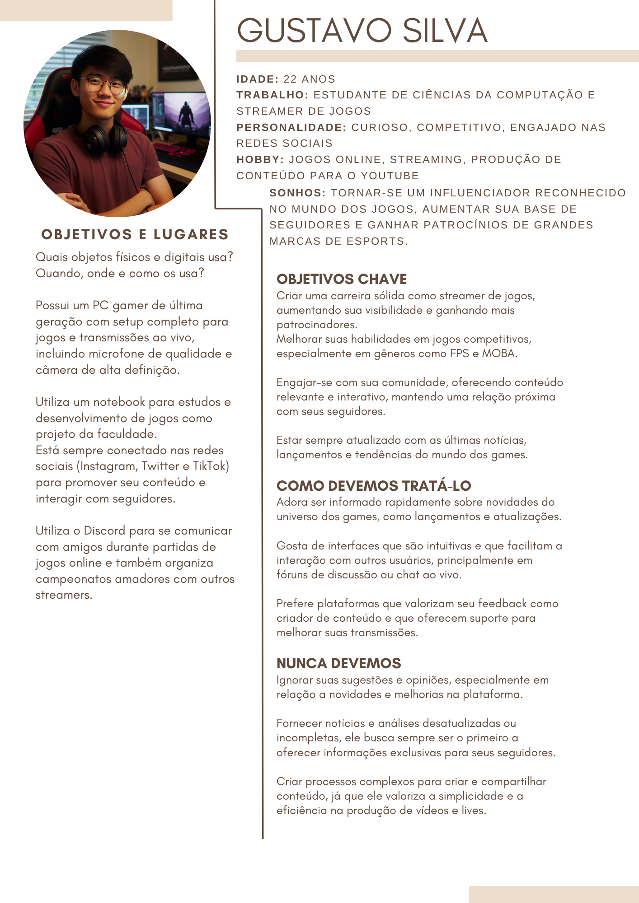
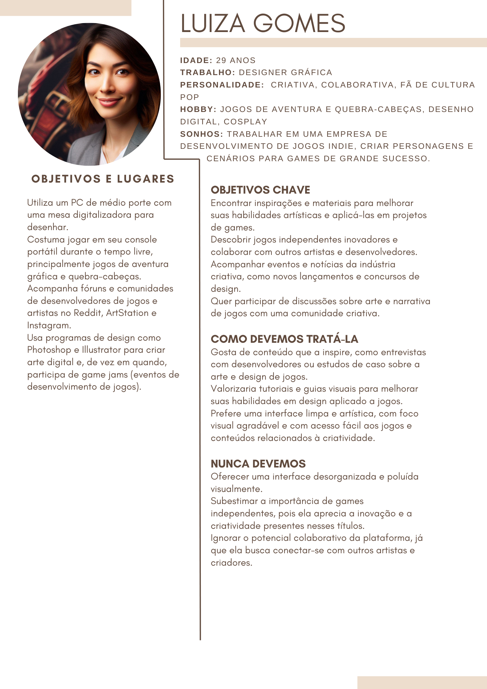
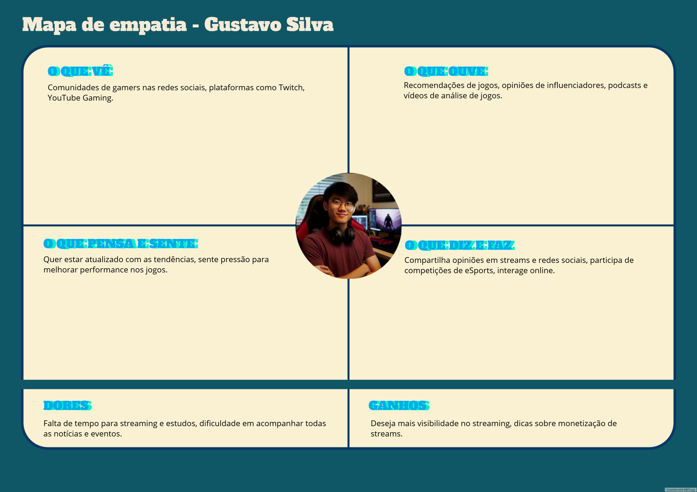
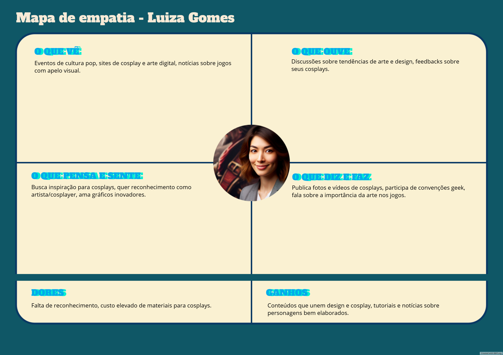
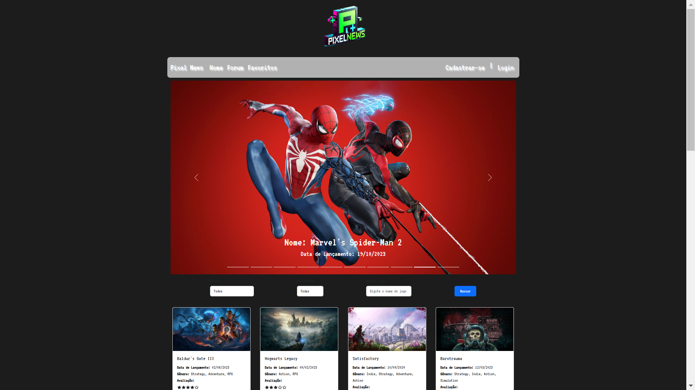
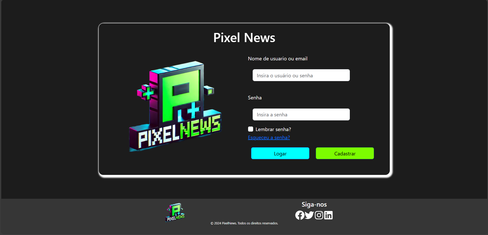
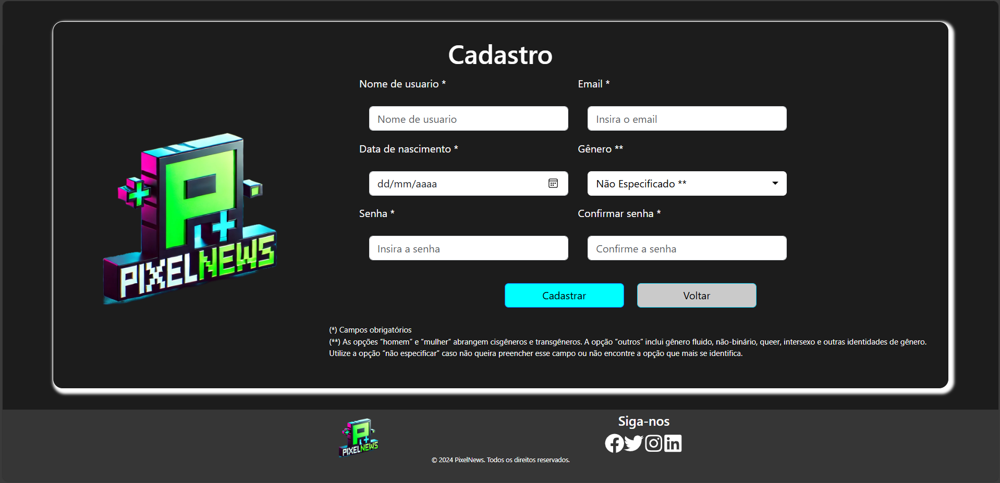
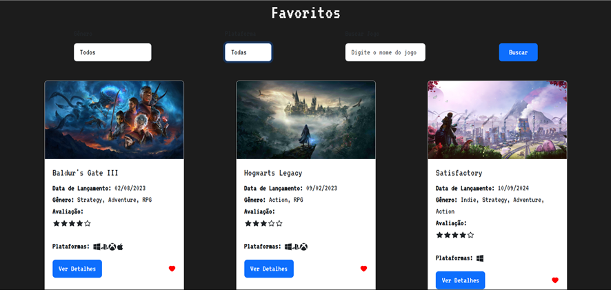
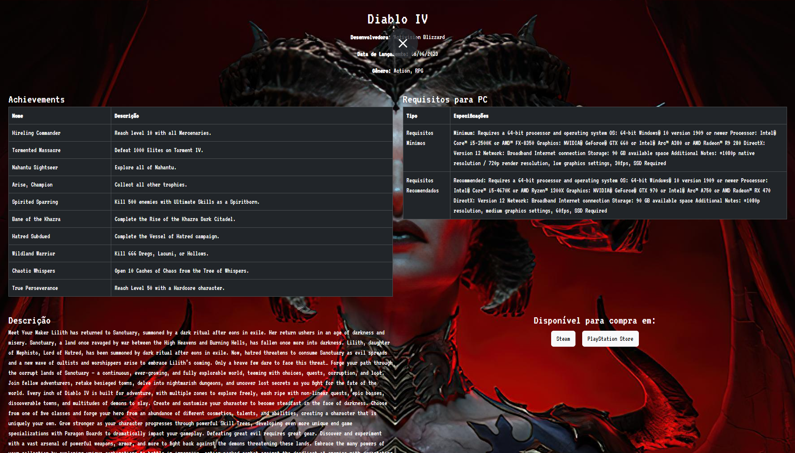
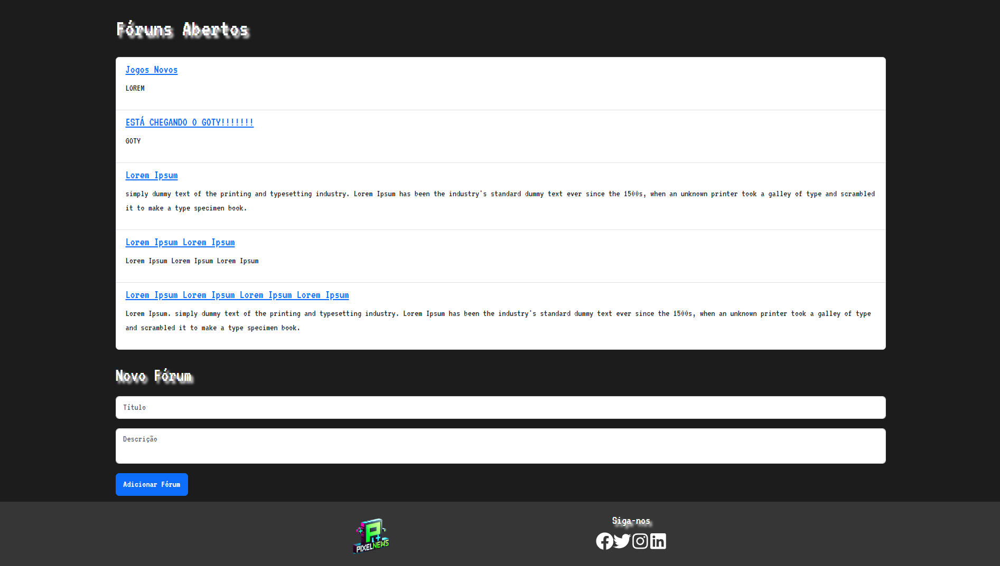

# 4. PROJETO DO DESIGN DE INTERAÇÃO

## 4.1 Personas

### Persona 1

### Persona 2

## 4.2 Mapa de Empatia
### Persona 1

### Persona 2

## 4.3 Protótipos das Interfaces

  4.3.1 - Tela Home:Por meio dessa tela, o usuário pode navegar rapidamente para diferentes áreas do sistema, acessar funcionalidades frequentes e obter uma visão geral do que precisa ser feito.
  

  4.3.2 - Tela de Login: Por onde o usuario irá realizar o login no sistema
  

  4.3.3 - Tela de Cadastro: Por onde o usuario irá realizar o cadastro no sistema
  

  4.3.4 - Tela de Jogos Favoritos: A tela onde o usuário pode visualizar uma lista de jogos que ele marcou como favoritos. Ela exibe informações principais de cada jogo, como nome, data de lançamento, gênero, avaliação e as plataformas onde o jogo está disponível. O usuário também pode aplicar filtros, como gênero e plataforma, para refinar a lista de jogos e usar a barra de busca para procurar um título específico. A tela permite ao usuário gerenciar sua lista de favoritos, adicionando ou removendo jogos conforme seu interesse.
  

  4.3.5 - Tela de Informações do Jogo: Esta tela exibe informações detalhadas sobre o jogo selecionado, incluindo sua descrição, data de lançamento, gêneros, avaliação e plataformas disponíveis. A tela também pode incluir imagens ou vídeos promocionais do jogo, além de links ou botões para acessar páginas relacionadas, como o site oficial ou uma loja online para compra.

4.3.6 - Tela de Foruns: A Tela de Fóruns exibe todos os fóruns abertos no sistema, permitindo que os usuários vejam e acessem as discussões disponíveis. Essa tela serve como um ponto central para que os usuários encontrem tópicos de discussão de interesse, participem de conversas, e acompanhem as atividades mais recentes.

4.3.7 - Tela de chat do Forum: Por meio dess tela o usário poderá realizar postagens dentro do forum.

  

