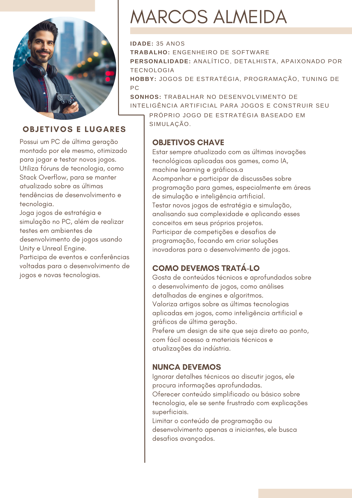
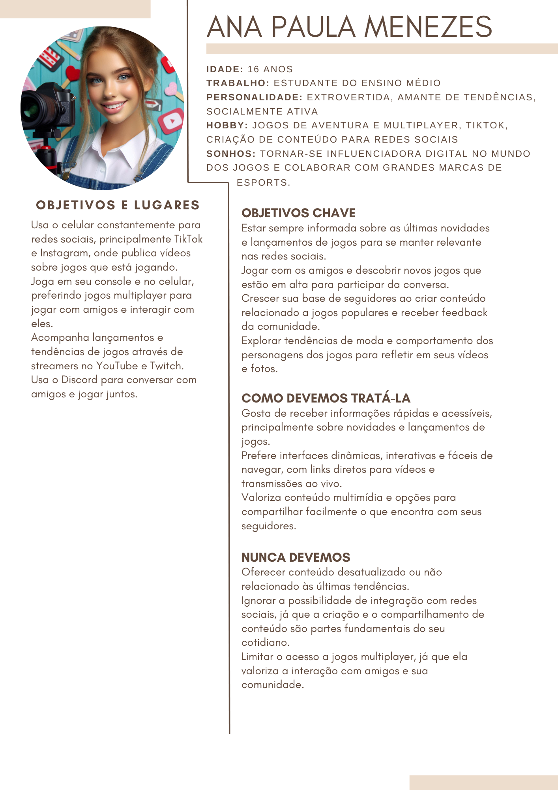

# 4. PROJETO DO DESIGN DE INTERAÇÃO

## 4.1 Personas
Nesta seção você deve detalhar as personas do seu projeto. Deve-se documentar uma persona por integrante do projeto. Sugere-se a utilização do gerador de personas disponibilizado ao final da página https://www.rdstation.com/blog/marketing/persona-o-que-e/.

### Persona 1

### Persona 2

### Persona 3

### Persona 4

## 4.2 Mapa de Empatia
| Persona                    | O que vê                                                                                          | O que ouve                                                                                   | O que pensa e sente                                                                               | O que diz e faz                                                                                      | Dores                                                                                  | Ganhos                                                                                           |
|----------------------------|---------------------------------------------------------------------------------------------------|---------------------------------------------------------------------------------------------|--------------------------------------------------------------------------------------------------|------------------------------------------------------------------------------------------------------|---------------------------------------------------------------------------------------|--------------------------------------------------------------------------------------------------|
| **Gustavo Silva (22 anos)** | Comunidades de gamers nas redes sociais, plataformas como Twitch, YouTube Gaming.                 | Recomendações de jogos, opiniões de influenciadores, podcasts e vídeos de análise de jogos. | Quer estar atualizado com as tendências, sente pressão para melhorar performance nos jogos.       | Compartilha opiniões em streams e redes sociais, participa de competições de eSports, interage online. | Falta de tempo para streaming e estudos, dificuldade em acompanhar todas as notícias e eventos. | Deseja mais visibilidade no streaming, dicas sobre monetização de streams.                        |
| **Luiza Gomes (29 anos)**   | Eventos de cultura pop, sites de cosplay e arte digital, notícias sobre jogos com apelo visual.   | Discussões sobre tendências de arte e design, feedbacks sobre seus cosplays.                | Busca inspiração para cosplays, quer reconhecimento como artista/cosplayer, ama gráficos inovadores. | Publica fotos e vídeos de cosplays, participa de convenções geek, fala sobre a importância da arte nos jogos. | Falta de reconhecimento, custo elevado de materiais para cosplays.                                | Conteúdos que unem design e cosplay, tutoriais e notícias sobre personagens bem elaborados.        |
| **Marcos Almeida (35 anos)**| Artigos e fóruns sobre desenvolvimento de jogos, comunidades de jogos de estratégia, análises.    | Conversas sobre inovação em jogos de estratégia, entrevistas com desenvolvedores.           | Gosta de jogos desafiadores, quer se manter atualizado com lançamentos e avanços em jogos.        | Comenta em fóruns sobre mecânicas de jogos, participa de competições e discussões sobre jogos complexos. | Falta de jogos desafiadores, tempo limitado para jogar devido ao trabalho.                         | Acesso a análises profundas e críticas, aprendizado de novas mecânicas e estratégias.              |
| **Ana Paula (16 anos)**     | Youtubers e streamers jogando seus jogos favoritos, redes sociais, memes sobre jogos.            | Recomendações de novos jogos, conversas sobre atualizações, influenciadores gamers.          | Quer se divertir com amigos, quer estar por dentro das novidades, gosta de personalizar avatares. | Joga com amigos, publica sobre suas vitórias, compartilha memes e vídeos engraçados de jogos.          | Conexão de internet instável, falta de atualizações ou bugs nos jogos.                             | Notícias sobre novos lançamentos, dicas e truques para melhorar a performance nos jogos.           |

## 4.3 Protótipos das Interfaces
Apresente nesta seção os protótipos de alta fidelidade do sistema proposto. A fidelidade do protótipo refere-se ao nível de detalhes e funcionalidades incorporadas a ele. Assim, um protótipo de alta fidelidade é uma representação interativa do produto, baseada no computador ou em dispositivos móveis. Esse protótipo já apresenta maior semelhança com o design final em termos de detalhes e funcionalidades. No desenvolvimento dos protótipos, devem ser considerados os princípios gestálticos, as recomendações ergonômicas e as regras de design (como as 8 regras de ouro). É importante descrever no texto do relatório como os princípios gestálticos e as regras de ouro foram seguidas no projeto das interfaces. Nesta etapa deve-se dar uma ênfase na implementação do software de modo que possam ser realizados os testes com usuários na etapa seguinte.

