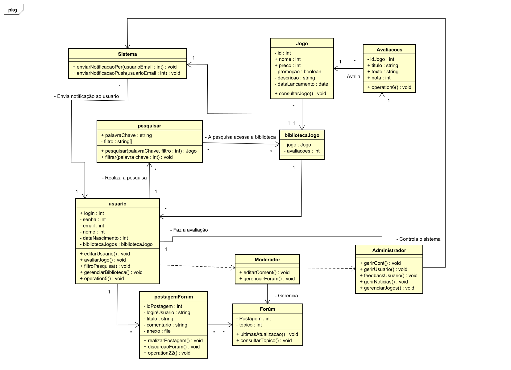

# 3. DOCUMENTO DE ESPECIFICAÇÃO DE REQUISITOS DE SOFTWARE

Constarão a seguir os detalhamentos dos requisitos do sistema.

## 3.1 Objetivos deste documento
Descrever e especificar as necessidades dos usuários que devem ser atendidas pelo projeto Portal de Notícias e Lançamentos do Mundo dos Videogames.

## 3.2 Escopo do produto

### 3.2.1 Nome do produto e seus componentes principais
O produto será um Portal de Notícias e Lançamentos do Mundo dos Videogames com o nome “PIXELNEWS”. Ele será composto por sete componentes (módulos), com elementos necessários à gestão de contas de usuário, publicação de notícias, avaliações e comentários, pesquisa e filtros avançados, gestão de conteúdo visual, sistema de notificações e feed personalizado, além de uma interface do usuário (UI) intuitiva e um banco de dados robusto.

### 3.2.2 Missão do produto
Fornecer uma plataforma interativa e abrangente para que os jogadores possam acessar as últimas notícias e lançamentos do mundo dos videogames, bem como avaliar, comentar e compartilhar suas opiniões sobre jogos, criando uma comunidade engajada e colaborativa, enquanto recebem informações atualizadas e personalizadas que enriquecem sua experiência gamer.

### 3.2.3 Limites do produto
O Portal de Notícias e Lançamentos do Mundo dos Videogames não fornece integração direta com plataformas de e-commerce para a compra de jogos ou acessórios. Além disso, o sistema não realiza curadoria automática ou moderação prévia dos comentários, avaliações ou conteúdos publicados pelos usuários, sendo necessário monitoramento manual ou por denúncias da comunidade para evitar abusos.

### 3.2.4 Benefícios do produto

| # | Benefício | Valor para o Cliente |
|--------------------|------------------------------------|----------------------------------------|
|1	| Acesso rápido e atualizado a notícias e lançamentos de jogos |	Essencial |
|2 | Ferramentas de avaliação de comentarios sobre jogos e notícias | Essencial | 
|3 | Personalização de feed e notificações de interesse gamer | Essencial | 
|4	| Pesquisa avançada e filtragem por gênero, plataforma, e data de lançamento | Essencial | 

## 3.3 Descrição geral do produto

### 3.3.1 Requisitos Funcionais

| Código | Requisito Funcional (Funcionalidade) | Descrição |
|--------------------|------------------------------------|----------------------------------------|
| RF1 | Gerenciar Usuários |	Processamento de Cadastro, Edição de Perfil, Recuperação de Senha e Exclusão de Contas de Usuários. |
| RF2 | Gerenciar Notícias	| O sistema deve permitir aos administradores criar, editar, publicar e excluir notícias relacionadas a lançamentos e atualizações no mundo dos jogos. |
| RF3	| Avaliar e Comentar Jogos |	Processamento de Avaliações de Jogos com Pontuação de 1 a 5 Estrelas e Publicação de Comentários em Notícias e Análises de Jogos. |
| RF4 |	Pesquisar e Aplicar Filtros	| Processamento de Pesquisa de Jogos, Notícias e Análises por Palavras-Chave e Aplicação de Filtros por Gênero, Plataforma, Data de Lançamento, entre Outros. |
| RF5 |	Gerenciar Conteúdo Visual	| Processamento de Upload, Gerenciamento e Exibição de Conteúdo Visual (Gráficos, Trailers, Imagens) para Complementar Notícias e Análises de Jogos. |
| RF6 |	Enviar Notificações Personalizadas	| Processamento de Envio de Notificações Automáticas com Base nas Preferências e Histórico de Navegação dos Usuários, Atualizando o Feed com Conteúdo Personalizado. |
| RF7 |	Facilitar Interação Social	| Processamento de Funcionalidades de Interação Social, Permitindo Comentários, Curtidas e Compartilhamentos de Conteúdos pelos Usuários. |
| RF8 |	Enviar Notificações Push	| Processamento de Envio de Notificações Automáticas sobre Novos Lançamentos de Jogos, Atualizações de Notícias e Respostas a Comentários, Tanto no Site Quanto via E-mail. |
| RF9 |	Gerenciar Eventos	| O sistema deve permitir a criação, edição, divulgação e exclusão de eventos de jogos, com detalhes como data, horário e informações adicionais. |
| RF10 |	Receber Feedback dos Usuários	| Processamento de Recebimento de Feedback dos Usuários sobre a Plataforma e Seus Conteúdos, Facilitando Melhoria Contínua do Site. |
| RF11 |	Gerenciar Biblioteca de Jogos	| O sistema deve permitir ao usuário adicionar, editar, excluir e visualizar sua biblioteca de jogos, incluindo informações detalhadas de cada jogo. |
| RF12 |		Gerenciar Fórum	| O sistema deve permitir a criação, edição, exclusão e moderação de tópicos e discussões no fórum, incluindo a capacidade de responder e interagir com outros usuários. |
| RF13 |		Login	| 	O sistema deve permitir que os usuários façam login utilizando suas credenciais (e-mail e senha) de maneira segura. |
| RF14 |		Logout	| 	O sistema deve permitir que os usuários façam logout de suas contas, encerrando sua sessão de maneira adequada e segura. |
| RF15 |			Gerenciar Jogos	| 	O sistema deve permitir aos administradores criar, editar, visualizar e excluir jogos, incluindo detalhes como nome, descrição, plataforma e data de lançamento. |

### 3.3.2 Requisitos Não Funcionais

| Código | Requisito Não Funcional (Restrição) | Descrição |
|--------------------|------------------------------------|----------------------------------------|
| RNF1 | Compatibilidade | O sistema deve ser compatível com múltiplos dispositivos e navegadores, incluindo desktops, tablets e smartphones, e ser responsivo para diferentes resoluções. | 
| RNF2 | Usabilidade | O portal deve proporcionar uma interface intuitiva e de fácil navegação, com uma curva de aprendizado mínima, permitindo o uso por usuários de diferentes perfis. |
| RNF3 |	Segurança | O portal deve utilizar criptografia SSL para proteger a comunicação de dados, especialmente informações de login e senha dos usuários. |
| RNF4 |	Desempenho |	O sistema deve carregar páginas em menos de 3 segundos em uma conexão padrão de internet. |
| RNF5 |	Escalabilidade |	O portal deve ser escalável para suportar um grande número de acessos simultâneos, especialmente durante eventos de grande tráfego, como lançamentos de jogos. |
| RNF6 |	Backup |	O sistema deve realizar backups automáticos diários, garantindo a recuperação em caso de falhas. |
| RNF7 |	Disponibilidade |	O portal deve ter alta disponibilidade, com 99% de uptime, exceto durante as janelas de manutenção previamente agendadas. |
| RNF8 |	Acessibilidade |	O portal deve seguir as diretrizes de acessibilidade (WCAG), permitindo o uso por pessoas com diferentes deficiências. |

### 3.3.3 Usuários 

| Ator | Descrição |
|--------------------|------------------------------------|
| Usuário Regular |	Usuário regular do sistema que pode visualizar e interagir com o conteúdo, como jogos, notícias e fóruns, além de comentar e avaliar, sem permissões administrativas. |
| Moderadores |	Usuários responsáveis por monitorar e moderar o conteúdo gerado por outros usuários, incluindo a exclusão de comentários e tópicos impróprios no fórum. |
| Administradores |	Usuários com acesso total ao sistema, responsáveis pela criação, edição e exclusão de jogos, notícias, eventos e pelo gerenciamento de usuários. |

## 3.4 Modelagem do Sistema

### 3.4.1 Diagrama de Casos de Uso
Como observado no diagrama de casos de uso da Figura 1, tanto moderador quanto o administrador, podem realizar diversas alterações referentes a parte de funcionamento das postagens, já o usuario comum, pode somente se auto editar e visualizar as postagens

#### Figura 1: Diagrama de Casos de Uso do Sistema.

 
### 3.4.2 Descrições de Casos de Uso

#### Login (CSU01)

Descrição: O usuario comum pode acessar o sistema através de suas credenciais.

Ator Principal: Usuario regular, Moderdores ou Administradores

Ator Secundário: Não possui

Pre-condições:
- o usuario deve estar cadastrado no sistema.

**Fluxo Principal**

 1) O usuário acessa a pagina de login e informa o usuário e senha.
 2) O sistema realiza a validação do login do usuário.
 3) Caso a senha esteja correta, o usuario poderá acessar o sistema e esse caso de uso se encerra; caso contrario o é retornado ao passo 1.

**Pós-condições:** O usuário tem acesso a informações como o seu perfil e as funcionalidades do forum.

*****

#### Logout (CSU02)

Descrição: O usuario comum pode sair do sistema e deixar de acessar as funcionalidades do site.

Ator Principal: Usuario regular, Moderdores ou Administradores

Ator Secundário: Não possui

Pre-condições:
- o usuario deve estar autenticado no sistema.

**Fluxo Principal**

 1) O usuário acessa a pagina de perfil e clica na opção "Sair".
 2) O sistema realiza a validação do logout do usuário.
 3) O usuário irá retornar a tela de login.

**Pós-condições:** O usuário deixa de ter acesso a informações como o seu perfil e as funcionalidades do forum, precisando realizar um novo "Login" para que possa retomar o acesso a conta.

***

#### Avaliar e comentar Jogos (CSU03)

Descrição: O usuario comum pode realizar uma avaliação de um jogo e atribuir nota.

Ator Principal: Usuario regular, Moderdores ou Administradores

Ator Secundário: Não possui

Pre-condições:
- o usuario deve estar autenticado no sistema.

**Fluxo Principal**

 1) O usuário acessa a página do jogo dentro do site.
 2) O usuário escreve a sua avaliação sobre o jogo, com um breve texto e uma pontuação entre 0 e 5.
 3) O usuário clica em publicar avaliação.
 4) O sistema processa o texto e o adiciona a pagina do Jogo na parte de avaliações.

**Pós-condições:** O usuário tem sua avaliação publicada no site e qualquer outro usuario poderá visualizar.

***

#### Pesquisar e aplicar filtros (CSU04)

Descrição: O usuario pode realizar uma pesquisa para encontrar determinado jogo, utilizando palavras chaves e filtros.

Ator Principal: Usuario regular, Moderdores ou Administradores

Ator Secundário: Não possui

Pre-condições:
- o usuario deve estar autenticado no sistema.

**Fluxo Principal**

 1) O usuário acessa a página de buscas dentro do site e realiza a inserção de uma palavra chave na aba de buscas.
 2) O usuário clica em "Buscar Jogo" e uma lista de jogos será apresentada.
 3) O usuário poderá selecionar filtros para melhorar os resultados encontrados.

**Pós-condições:** É apresentado ao usuário uma lista de jogos baseados nas palavras chaves e filtros aplicados.

***

#### Gerenciar biblioteca de Jogos (CSU05)

Descrição: O usuario possui uma lista de jogos em que pode adicionar, remover, favoritar jogos.

Ator Principal: Usuario regular, Moderdores ou Administradores

Ator Secundário: Não possui

Pre-condições:
- o usuario deve estar autenticado no sistema.

**Fluxo Principal**

 1) O usuário acessa a página de um jogo dentro do site.
 2) O usuário clica na opção "adicionar a Lista".
 3) Irá mostrar um popup para o usuário solicitando para que ele escolha qual lista de jogos que deseja adicionar o jogo.
 4) Ao selecionar a lista, irá aparecer uma notificação mostrando que o jogo foi adicionado a lista determinada pelo usuário.

**Pós-condições:** O usuário tem um novo jogo adicionado a lista de jogos em sua biblioteca e poderá acessa-los a qualquer momento.

***

#### Facilitar interação social (CSU06)

Descrição: Moderadores ou Administradores possuem recursos para facilitar a interação entre os usuários, dentre esses recurso está a divulgação de uma pagina ou conteudo especifico (Highlight), destacar comentarios de postagens do forúm.

Ator Principal: Moderdores ou Administradores

Ator Secundário: Não possui

Pre-condições:
- O Moderador deve estar autenticado no sistema.

**Fluxo Principal**
 1) O moderador acessa o forúm e nas abas de discursão
 2) O moderador poderá selecionar algum comentario em alguma postagem e ativaria a função de destaque para esse comentario.
 3) O sistema processa a solicitação e adicona um indicação de comentario "destaque".

**Fluxo Alternativo: Inclusão**
1) O moderador realiza uma postagem no forúm e seleciona a opção de "Postagem Divulgação".
2) Após selecionar realizar a publicação da postagem, o sistema irá processar e depois irá notificar que o conteúdo foi publicado no site. 

**Pós-condições:** A postagem de divulgação é mostrada no forúm para todos os usuarios como postagem prioritaria, porém com uma prioridade abaixo das postagens de aviso.

***

#### Gerenciar Forúm (CSU07)

Descrição: Os usuários realizam a gestão do forum, podendo adicionar e editar conteúdos proprios. Os Moderadores e Administradores podem realizar as mesmas funções com a adição de que foram publicados dentro do forúm e possuem a permissão para excluir comentarios e postagens, como também banir usuários.

Ator Principal: Moderdores ou Administradores

Ator Secundário: Não possui

Pre-condições:
- O Moderador/Administrador deve estar autenticado no sistema.

**Fluxo Principal**

 1) O usuário acessa a página de sua lista de jogos dentro do site.
 2) 

**Pós-condições:** O usuário tem sua avaliação publicada no site e qualquer outro usuario poderá visualizar.

### 3.4.3 Diagrama de Classes 

#### Figura 2: Diagrama de Classes do Sistema.
 

### 3.4.4 Descrições das Classes 

| # | Nome | Descrição |
|--------------------|------------------------------------|----------------------------------------|
| 1	| Usuario |	Acessar e visualizar conteúdo público e o forúm, avaliar e comentar conteúdo do site e forúm, editar perfil pessoal, gerenciar biblioteca de jogos, favoritar conteúdo |
| 2	| Moderador |	Todas as permissões de um usuário comum, editar ou excluir comentários de outros usuários no forúm, moderar discussões e postagens. |
| 3 | Administrador |	Todas as permissões de um moderador, gerenciar cargos e permissões de todos os usuários, acessar e modificar configurações do sistema; criar, editar ou excluir qualquer conteúdo, bloquear ou desbloquear qualquer usuario, acessar relatórios de atividades suspeitas. |
| 4 | Sistema | Realiza as funções enviar notificações ao usuário sobre atualizações do site e notifica sobre coisas relacionadas a jogos especificados pelo usuário |
| 5 | Jogo | Contem todas as informações relacionadas a um determinado jogo, esse mesmo podendo receber avaliações dos usuários do site |
| 6 | BibliotecaJogo | Lista de jogos favoritados pelos usuários |
| 7 | Avaliacoes | Dados criados pelos usuários para avaliar um determinado jogo e atribuir uma nota de 1 a 5. |
| 8 | Pesquisar | Encontra determinado jogo a partir de palavras chave e filtros que podem ser especificados pelo usuário. |
| 9 | PostagemForum | Comentario no forum realizado por qualquer usuário, pode ser respondido com outros comentarios ou postagem, podem receber curtidas (likes) ou descurtidas (dislike) |
| 10 | Forum | Area do site dedicada a discursões e conversar entre os usuários, o Moderador e o Administrador têm acesso a funcionalidades exclusivas, o forum não permite usuários banidos entrarem, os comentarios e discursões podem ser realizadas a qualquer horário |
